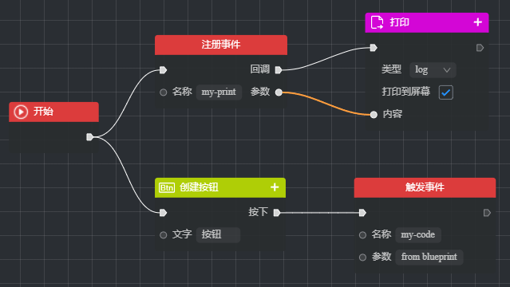

# 蓝图

`ThingJS`的蓝图是一种可视化的开发方式，用户通过拖拽、连接、配置节点的操作，来创建对象并控制它们的行为和交互，从而降低了引擎的使用门槛。


**蓝图特点**：蓝图具有强复用性和低耦合性，只要按照标准编写一个蓝图节点，无论这个节点是使用`ThingJS`的`API`还是其他功能，都可以整合到任何一个蓝图中去，与其他蓝图节点协作。

**蓝图组成**：蓝图由节点`node` 和 连线`connection`组成，节点包括一些输入`inputs`和输出`outputs`的连接点与其他节点相连。

**节点分类**：蓝图节点大体上可以分为 事件节点、动作节点、对象节点、流程控制节点、综合节点（预制件、子图等）。

## 加载蓝图
如果需要在`ThingJS`项目中加载蓝图文件，首先要确保这个蓝图中用到的节点已被注册，`ThingJS`中经常用到的节点包含在：[thing.blueprint.nodes.js](./xx.js "blueprint.nodes")，如果有其他自定义节点也需要确认引入并注册。

然后可以使用`app.load()`方法加载蓝图文件，加载后得到一个蓝图对象`blueprint`，调用`run()`来运行：
```html
<script src="./libs/thing.min.js"></script>
<script src="./libs/thing.blueprint.nodes.js"></script>
<script>
    const app = new THING.App();

    let asset = await app.load("/blueprints/bp01.json");
    let blueprint = asset.blueprints[0];
    blueprint.run();
</script>
```

可以对蓝图进行变量的设置，或触发蓝图中的事件
```javascript
// 设置变量
blueprint.setVar('power', 100);

// 触发这个蓝图中的事件（其他蓝图的同名事件不执行）
blueprint.triggerEvent('my-event', {...});
```

## 开发节点

如果想对蓝图进行扩展，可以通过自定义蓝图节点的方式，将你需要的功能封装到一个蓝图节点中，然后在蓝图中进行调用。

自定义蓝图节点，首先要继承蓝图节点类`THING.BLUEPRINT.BaseNode`，配置`config`中的`inputs`，`outputs`等属性，并实现`onExecute()`方法
```javascript
class MyNode extends THING.BLUEPRINT.BaseNode {
  // 节点配置信息
  static config = {
    // 蓝图节点的名称
    name: '点击事件',

    // 输入连接点
    inputs: [
      {
        name: '开始',
        type: 'exec',
      },
    ],

    // 输出连接点
    outputs: [
      {
        name: '下一步',
        type: 'callback',
      } 
    ]
  }

  // 蓝图节点执行时调用
  onExecute(data, inputs) {
  }

  // 蓝图节点停止时调用（一般是蓝图停止时）
  onStop() {
  }
}
```

在定义蓝图节点后，无论是在蓝图编辑环境下，还是在蓝图运行时，当使用自定义节点时，都需要对其进行注册。
```javascript
THING.BLUEPRINT.Utils.registerNode(MyNode);
```

## 蓝图通信
`ThingJS`中的自定义事件，在代码和蓝图中是等效的，所以可以通过 **自定义事件**，来进行代码和蓝图的双向通信，即：
* 在`ThingJS`代码中，触发蓝图中的事件节点，执行蓝图中的自定义操作；
* 或在蓝图中，触发自定义事件，然后执行`ThingJS`代码中的操作；

例如，在蓝图中编辑下面的节点：



运行蓝图后，在`ThingJS`中调用下面代码，可以通过蓝图打印出`from code`：
```javascript
app.trigger('my-print', {'param': 'from code'});
```

运行蓝图后，点击场景中的按钮（由蓝图创建），可以打印出`from blueprint`：
```javascript
app.on('my-code', (ev)=>{console.log(ev);});
```

## 更多内容

请参考`UINO`文档中的 [蓝图文档](https://wiki.uino.com/book/612f5205dec53e3d4278d89a/612f6719428a975580acb27d.html "蓝图文档")（需要更新！）

