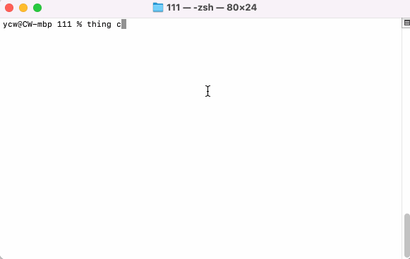
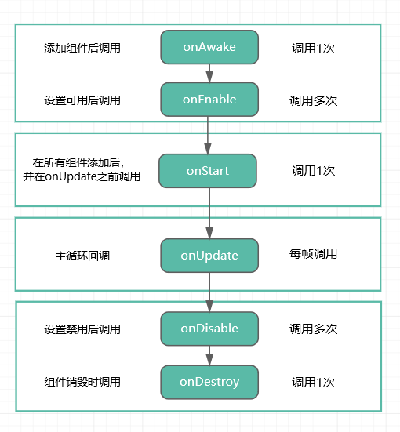
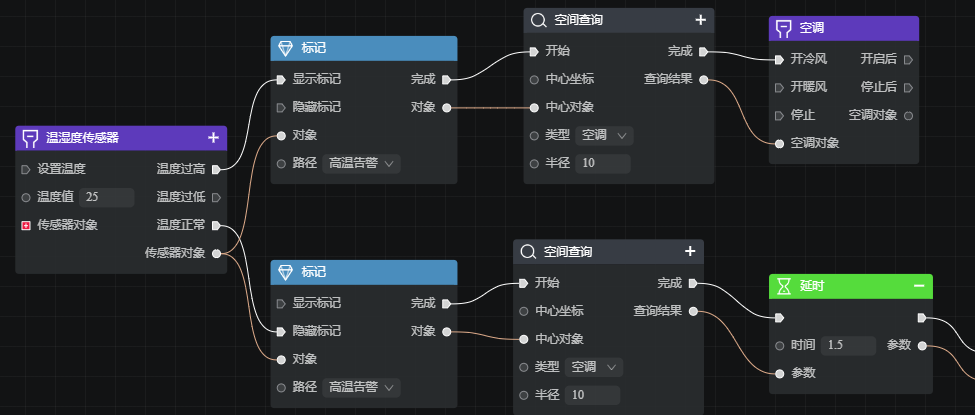
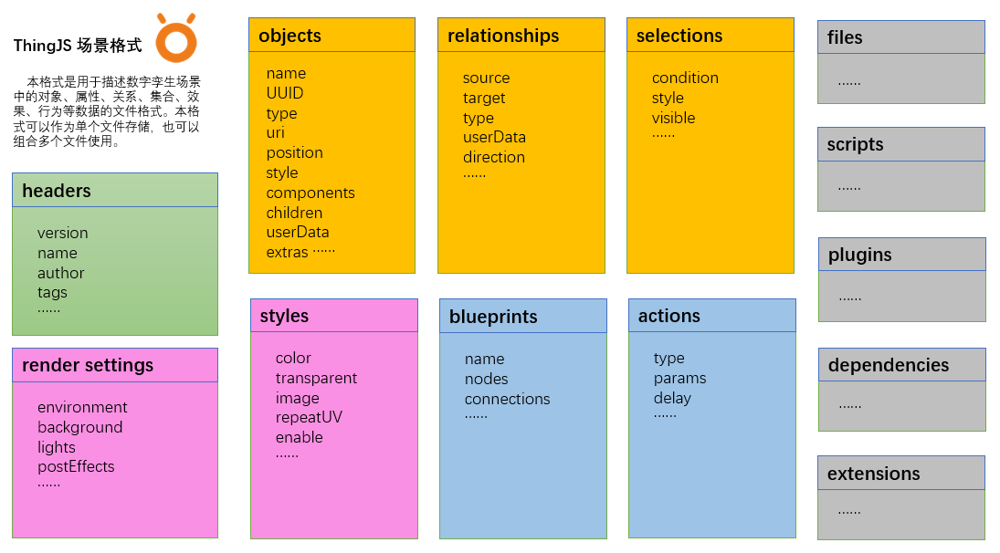

[TOC]

# 介绍
<!-- introduce -->

`ThingJS`是一个高性能、效果丰富、可扩展、低门槛的Web3D引擎，用于帮助开发者更高效地构建 “数字孪生可视化” 应用

## 特点
- **高性能**：引擎对常见的园区/建筑/城市等多层级的场景、大量静态、动态物体等进行了优化，在Web3D上达到更[高性能](https://www.thingjs.org.cn/)；

- **孪生体**：孪生体对象`Object`（简称对象）是引擎的基本控制单元，可以通过模型、预制件等资源来创建对象，引擎提供对象的关系、属性、行为（事件+动作）的封装，让孪生场景[更智能](https://www.thingjs.org.cn/)；

- **多层级**：引擎支持从地球空间进入到城市、园区、建筑、楼层、房间、设备等的多个[空间层级](https://www.thingjs.org.cn/)；

- **多效果**：针对不同的管理场景，通过应用效果模板，提供快捷、丰富视觉[效果切换](https://www.thingjs.org.cn/)；

- **低门槛**：更少的专业3D概念，更符合行业开发者的API设计，更少的代码量，并支持蓝图等可视化开发方式，让开发[效率更高](https://www.thingjs.org.cn/)；

- **可扩展**：用户可以通过：组件`Component`、插件`Plugin`、预制件`Prefab` 等多种方式，对系统功能、对象功能进行扩展；

- **跨引擎**：支持多渲染底层，学习一种API，既可使用多种3D底层渲染的引擎；

- **接数据**：更方便对接真实数据，以及提供数据仿真展示；


# 安装
<!-- install -->

## 通过 CDN 使用

全局引入使用
```javascript
<script src="https://cdn.uino.cn/thingjs-cli/thing.js"></script>
<script type="module">
    const app = new THING.App();
</script>
```

ESModule 方式使用
```javascript
<script type="module">
    import { App, Component } from 'https://cdn.uino.cn/thingjs-cli/thing.esm.js';
    const app = new App();
</script>
```

Import maps 方式使用
```javascript
<script type="importmap">
{
    "imports": { "@thing.js/core": "https://cdn.uino.cn/thingjs-cli/thing.esm.js"}
}
</script>
<script type="module">
    import { App, Component } from '@thing.js/core';
    const app = new App();
</script>
```

## 通过 NPM 安装

在当前工程下，安装依赖：
```bash
> npm install @thing.js/core --save	
```

引入全部模块：
```javascript
import * as THING from '@thing.js/core';
```

按需引入模块：
```javascript
import { App, Component } from '@thing.js/core';
```

## 通过 CLI 安装

全局安装
```bash
> npm install @thing.js/cli -g
```

使用`thing create`创建项目，提供常用的 `Simple`、`Vue`、`React` 等模板。
```bash
> thing create project-name
```


> 注意，上面的安装中，如果在`Windows PowerShell`下，需要增加引号：`'@thing.js/cli'`

# 入门
<!-- getting-started -->

## 初始化
使用`ThingJS`引擎，首先要创建一个`App`实例，`App`是引擎中的主要入口，提供了资源加载、对象管理、对象查询、事件注册等等各种功能，一般只需要创建一个：

```javascript
const app = new THING.App();
```

`ThingJS`使用页面上标签为`div3d`的元素，作为默认的渲染区域，`ThingJS`将会在这个`div`内创建`WebGL`以及一些需要的页面元素。下面是一个完整的页面例子：
```html
<!DOCTYPE html>

<html lang="en">
    <head>
        <title>ThingJS</title>
        <meta charset="utf-8" />
        <script src="./thing.js"></script>
    </head>

    <body style="margin: 0; padding: 0">
        <div id="div3d"></div>
    </body>
    
    <script type="module">
        const app = new THING.App();
    </script>
</html>
```
> 注意：请在页面元素`div3d`初始化后，再创建`App`

如果需要手动指定元素的标签，可以使用`container`参数：
```javascript
const app = new THING.App({
    container: document.getElementById('div3d')
});
```
## Hello World
在初始化`App`时，可以传入一个`url`参数，`url`可以是一个包含了场景信息的 [gltf](https://www.khronos.org/gltf/) 文件，或一个`ThingJS`场景格式的`JSON`文件，这样就可以加载一个场景：
```javascript
const app = new THING.App({
    url: "./assets/scene/scene.gltf",
    onComplete: function(ev) {
        console.log(ev); // 加载完成后回调
    }
});
```

在初始化`App`后，创建一个立方体盒子，并在更新事件中让这个`Box`旋转：
```javascript
// 创建一个宽、高、深为1、2、3的盒子
let box = new THING.Box(1, 2, 3);

// 场景更新事件
app.on('update', function(deltaTime) {
    if (box != null)
        box.rotateY(0.1);
});
```

<!-- 示例：
<playground src="sample_box.js"></playground> -->

关于`App`的更多功能请参考后续文档和API手册。


# 对象基础
<!-- object -->
在`ThingJS`中，对象`Object`是引擎提供的基本控制单元。对象具有唯一的标识，能被单独创建、销毁、查询，具有属性、方法、事件，能与其他对象建立关系。

对象的基类是`BaseObject`，可以通过 **继承** 或 **组合** 的方式对其进行扩展，如：
* 三维对象类`Object3D`提供了空间变换和渲染功能；
* 物体类`Entity`是最常用的类型，提供了模型或预制件的功能；
* 三维空间类`Space3D`提供了空间计算功能；

你可以继承这些类型，来进行扩展。你也可以通过`Component`，给对象增加组件，进行扩展。

在`ThingJS`中，**孪生体** 的是基于对象实现的（`BaseObject`子类）。当一个对象的`id`属性被设置具体值，并且和真实世界中的对象`id`有对应关系，则成可以认为这个对象是一个孪生体。

## 对象属性
对象的基础属性，名称`name`、编号`id`和唯一标识`uuid`。可以通过`app.query`来查询这些属性，其中`name`和`id`属性在场景中可以重复。`uuid`为不可重复属性，可以作为持久化的唯一标识：
```javascript
// 名称
obj.name = "car01";
// 编号
obj.id = "001";
// 唯一标识
console.log(obj.uuid); // "5811f0ecf97811ed9a4fc0b5d78a0456";
```

对象类型存储在`type`属性中，内部类型如`Entity`、`Object3D`，或扩展类型如`Building`、`Room`，或自定义类型`Cabinet`等。
```javascript
let type = obj.type;
console.log( type );
```

对象标签`tags`，可以存储多个字符串作为对象的标签，可以根据标签来查询：
```javascript
obj.tags = ["Vehicle", "Truck"];
```

对象的用户数据，可以通过`userData`存储自定义数据：
```javascript
obj.userData = {
    "品牌": "UINO",
    "编号": "M001",
    "重量": 100,
}

let dat = obj.userData["品牌"];
```

## 创建物体

对象的基类`BaseObject`类型不能直接创建，一般使用其子类，如：Entity。

物体或叫实体`Entity`，是一个具有可见外观的三维对象，比如：设备、车辆等。在创建`Entity`时，构造方法中可以直接传入一个`url`来进行初始化，`url`可以是一个`gltf`的模型文件，或一个预制件文件的路径。参数中可以设置位置、旋转等空间参数，    还可以通过`onComplete`回调来等待加载完成：

```javascript
// 资源url，可以是一个gltf文件，或一个资源包的路径
const url = "./models/car.gltf";

// 创建物体，根据给定URL的资源物体，路径为模型或预制件
let obj = new THING.Entity({
    url,
    position: [2, 0, 0],
    rotation: [0, 45, 0],
    onComplete: function() {
        // 加载资源完成的回调
        console.log("object created");
    }
});
```

或者通过`obj.waitForComplete`方法等待`Entity`加载完成：
```javascript
// 创建物体，await等待完成
let obj = new THING.Entity({url});
await obj.waitForComplete();
console.log(obj.name);

// 或者使用then
obj.waitForComplete().then(function() {
    console.log(obj.name);
});
```

<!-- 示例：
<playground src="create_entity.js"></playground> -->

## 创建空间

**三维空间** `Space3D`是具有一定体积的三维对象，可进行空间计算，不具有可见外观，但可渲染其边界。其他对象可以包含空间对象，空间对象也包含其他对象，比如建筑内可以包含一个空间对象作为某种特殊用途的区域。

```javascript
// 创建立方体空间
let space = new THING.Space3D({
    position: [0, 0, 0],
    size: [10, 20, 30]
});
```

多个空间对象组合成一个空间对象
```javascript
space.add(space01);
space.add(space02);
space.add(space03);
space.children; // 子空间就在children中
```

空间计算：包含、相交、相离
```javascript
// 包含计算，返回bool，默认传递孩子
space.contains(obj, cascade = true);

// 相交计算，返回bool
space.intersects(obj, cascade = true);

// 相离计算，返回bool
space.disjoint(obj, cascade = true);
```

空间可视化，将空间渲染出来
```javascript
space.showBounding(true);
```

<!-- 示例：
<playground src="create_space3d.js"></playground> -->


## 父子对象
对象可能具有父对象`obj.parent`或子对象`obj.children`，他们一般是由加载场景时自动创建的，也可以在运行时改变。

访问父对象、子对象属性：
```javascript
// 子对象
obj.children

// 父对象
obj.parent

// 父对象数组（包括父亲和父亲的父亲）
obj.parents

// 兄弟对象数组（有共同父亲的对象）
obj.brothers
```

可以使用`add`、`remove`接口来添加或移除父子关系
```javascript
obj.add(childObj);
obj.remove(childObj);
```

可以通过`traverse`来遍历所有子对象：
```javascript
obj.traverse((child) => {
    console.log(child);
})
```

父对象和子对象`parents`和`children`等都是选择集类型，当需要寻找单个对象时，可以使用`find`接口进行搜索，找到立即返回，比`query`接口更高效：
```javascript
obj.children.find('#001');
obj.parents.find('.Floor');
```

## 克隆和销毁

可通过`clone`方法，来复制一个对象，复制过程会连同对象本身的组件、属性、子对象等一起复制：
```javascript
// 克隆 对象
let cloneObj = obj.clone();
```

可以直接调用对象的销毁，或通过`App`查询对象并进行销毁。销毁一个对象，会包括他身上的组件、子对象等一起销毁。同时，对象所使用的相关资源，也会通过引用计数的方式被销毁（没有用到的资源会被自动销毁）。

```javascript
// 销毁
obj.destroy();
obj = null;

// 先查询到对象，再销毁
app.query('car01').destroy();
```

## 更多功能

对象还有具有如：查询`query`，组件`components`，效果`style`，空间变换`position`，关系`relationships`，事件`events`等更多功能，请参考对象相关文档。

# 空间属性
<!-- transform -->

三维对象`Object3D`的子类都会提供位置、旋转、缩放等空间属性，你可以通过设置一个值，或设置一个变化过程，来改变对象的空间属性。

## 设置属性
通过设置值来立即改变对象的空间属性：
```javascript
// 设置位置
obj.position = [0, 10, 0];

// 设置旋转
obj.rotate(45); // 沿默认轴旋转45度
obj.rotateOnAxis([0, 0, 1], 45); // 沿给定轴旋转45度
obj.rotateY(45); // 沿Y轴旋转
obj.rotation = [45, 0, 0];

// 设置缩放
obj.scale = [1, 2, 1]; // 沿y轴缩放2倍
```
`ThingJS`中，通常使用三个元素数组来代表一个三维坐标`[0, 10, 0]`，一个数值代表角度`45`，或三个元素的数组代表三个轴的旋转角度`[45, 0, 0]`。

## 位置移动
可以通过`moveTo`方法，让对象移动到某个位置：
```javascript
// 设置移动
obj.moveTo([10, 0, 0]);

// 移动参数
obj.moveTo([10, 0, 0], {
    loopType: THING.LoopType.PingPong,
    duration: 2000 // 2秒
});

// 完成回調
obj.moveTo([10, 0, 0], {
    loopType: THING.LoopType.PingPong,
    duration: 2000,
    onComplete: function() {
        console.log("move complete");
    }
});
```

或`movePath`方法，让对象沿指定的路径移动，路径是一个三维点数组：
```javascript
obj.movePath({
    path: [[10, 0, 0], [10, 0, 10], [0, 0, 0]],
    loopType: THING.LoopType.PingPong,
    duration: 2000,
    loop: true, // 路径点按照首尾相接闭环移动
    onComplete: function() {
        console.log("movePath complete");
    }    
});
```

## 旋转动画
可以通过`rotateTo`方法，让对象旋转到一个指定角度，可以用于动画效果：
```javascript
// 旋转到某个角度
obj.rotateTo([0, 90, 0]);

// 旋转到某个角度，如果需要完成时可回调
obj.rotateTo([0, 90, 0], {
    duration: 2000,
    onComplete: function() {
        console.log("rotateTo complete");
    }    
});

// 旋转到某个角度，以PingPong的方式循环，每次时间2秒
obj.rotateTo([0, 90, 0], {
    loopType: THING.LoopType.PingPong,
    duration: 2000
});
```

## 缩放动画
可以通过`scaleTo`方法，让对象缩放到一个指定大小，可以用于动画效果：
```javascript
// 缩放到2倍
obj.scaleTo([2, 2, 2]);

// 缩放到2倍，以PingPong的方式循环，循环10次，每次时间2秒
obj.scaleTo([2, 2, 2], {
    loopType: THING.LoopType.PingPong,
    loop: 10,
    duration: 2000
});
```

<!-- 示例：
<playground src="object_transform.js"></playground> -->

## 坐标转换
对象的世界坐标和相对坐标的转换：
```javascript
// 世界坐标
let pos = obj.position;

// 相对父亲坐标
let local = obj.localPosition;

// 相对坐标转世界坐标
let pos = obj.localToWorld([10, 0, 0]);
// 世界坐标转相对坐标
let local = obj.worldToLocal(pos);
```
对象的世界坐标和自身坐标的转换：
```javascript
// 自身坐标转世界坐标
let pos2 = obj.selfToWorld([10, 0, 0]);
// 世界坐标转自身坐标
let selfPos = obj.worldToSelf(pos2);
```

## 轴心点
对象轴心点，主要用于旋转和缩放操作，可以理解为是对象自身坐标系的原点，比如旋转一个立方体，那么旋转就是围绕其轴心点进行。
```javascript
// 设置对象轴心点
obj.pivot = [0.5, 0.5, 0.5];

// 绘制物体的轴心点
obj.helper.axes = true;
```

## 包围盒
包围盒是对象的一个边界，分为轴对齐包围盒`boundingBox`（不带旋转），有向包围盒`orientedBox`（带旋转的包围盒），后者更贴近物体：
```javascript
// 轴对齐包围盒
const boundingBox = obj.boundingBox;
let center = boundingBox.center // 对象的中心
let size = boundingBox.size; // 对象的大小

// 有向包围盒
const orientedBox = box.orientedBox;
let angles = orientedBox.angles; // 角度
```
显示包围盒：
```javascript
obj.helper.boundingBox.visible = true;
```

# 对象效果
<!-- style -->

## 显示隐藏
对象可以通过`visible`属性或`setVisible`接口，来设置显示隐藏状态，区别是`setVisible`接口可以**控制**是否传递这个显示隐藏状态给孩子：

```javascript
// 设置【自己】和【子对象】的显示隐藏状态，并修改visible值
obj.visible = value;

// 如果cascade参数为true，则设置【自己】和【子对象】的显示隐藏状态，并修改visible值
// 如果cascade参数为false，则仅设置【自己】的显示隐藏状态，并修改visible值，不影响【子对象】
obj.setVisible(value, cascade=true);

// setVisible接口支持回调，如下例子代码，隐藏除了名字为car01的其他对象
obj.setVisible(false, (obj)=> {
    if (obj.name == "car01")
        return false;
});
```

对象的`inherit.visible`属性可以设置这个对象是否跟随父亲的显示隐藏状态：
```javascript
// 是否继承父对象的显示隐藏状态，true, false, 更多参考枚举：THING.InheritType
obj.inherit.visible = false;
```

下面举几个例子，其中假设`building`对象包含多个`floor`对象：

```javascript
// 例子1：隐藏【自己】和【子对象】，并修改visible值为false
obj.visible = false;

// 例子2：只隐藏【自己】不隐藏子对象：
obj.setVisible(false, false);

// 例子3：建筑在显示状态时，先隐藏建筑，再显示某层中的一个对象，只显示这个对象
obj.inherit.visible = false;
building.visible = false;

// 例子4：隐藏父亲，打印孩子visible状态；
building.visible = false;
console.log(floor.visible); // 打印false
```
除了`visible`设置，还可以通过激活状态`active`来达到控制显示隐藏的效果，和`visible`属性不同的是，`active`属性不会修改子对象的显示隐藏状态，所以`active`可以用于 **需要保持子对象显示隐藏状态** 的情况，且`active`的性能更好（因为不会遍历孩子）：

```javascript
// 设置【自己】的激活状态，但不修改【子对象】的激活状态，false时，【子对象】会被隐藏
obj.active = false;
```

## 效果样式

对象可以通过`style`属性或`setStyle`接口，来设置样式：

```javascript
// 设置对象样式，设置【自己】和【子对象】的样式
obj.style = value;

// 如果cascade参数为true，则设置【自己】和【子对象】的样式
// 如果cascade参数为false，则仅设置【自己】的样式，不影响【子对象】
obj.setStyle(value, cascade=true);
```

对象的`inherit.style`属性可以设置这个对象是否跟随父亲的样式变化：
```javascript
// 是否继承父对象的样式，true, false, 更多参考枚举：THING.InheritType
obj.inherit.style = false;
```

下面设置`style`的例子代码：

```javascript
// 例子：
obj.style.color = '#ff0000'; // 修改颜色
obj.style.opacity = 0.5; // 修改透明度
// obj.style.image = 'images/some.png'; // 修改图片
obj.style.image = new THING.ImageTexture('images/some.png');
obj.style = {
    "color": "#FF0000",
    "outlineColor": "#0000FF"
}; // 多参数样式
```

对象淡入、淡出效果的，可以通过调用`fadeIn`、`fadeOut`实现：
```javascript
// 淡入
object.fadeIn({
    loop: 2, // 2 次，如果是true则是循环
    duration: 2000
});
// 淡出
object.fadeOut({
    duration: 2000
});
```

```javascript
// 开启批量渲染
app.query('*').makeInstancedDrawing();
```


# 对象动画
<!-- animation -->

如果`Entity`的资源中包含动画，可以用`playAnimation`方法来播放动画：
```javascript
obj = new THING.Entity({
    url: './models/spaceman.gltf'
});

// 指定名称播放动画
obj.playAnimation({
    name: "walk",
    loopType: THING.LoopType.Repeat
});
```

动画完成后的回调
```javascript
obj.playAnimation({
    name: "walk",
    onComplete: function() {
        console.log("animation complete");
    }
});
```

停止动画播放
```javascript
// 停止某个动画
obj.stopAnimation(animName);

// 停止所有动画
obj.stopAllAnimations();
```

可以通过`animations`属性来获取动画信息：
```javascript
let anim = obj.animations[0];
let duration = anim.duration;
let speed = anim.speed;
let state = anim.state;
```
> 注意：如果需要获取物体动画的信息，要在物体加载完成后才能获取

```javascript
// 打印物体所包含动画的名称
obj = new THING.Entity({
    url: './models/spaceman.gltf'
    onComplete: function(ev) {
        let obj = ev.object;
        let animName = obj.animations[0].name;
        console.log(animName);

        obj.playAnimation({name: animName})
    }
});
```


# 对象关系
<!-- relationship -->

在`ThingJS`引擎中，对象和对象之间最常用的是父子关系（或叫属于关系），此外还可以创建各种自定义关系。

## 创建关系
可以通过`new THING.Relationship`来创建自定义关系，需要制定关系类型`type`、关系的源对象`source`和目标对象`target`（源和目标可以是多个对象），关系还可指定标签`tags`和自定义属性`userData`，下面是几个创建关系的例子：
```javascript
// 创建关系
let rls = new THING.Relationship({
    type: "control",
    name: "control01",
    source: obj1,
    target: obj2,
});

// 创建关系，更多参数
let rls2 = new THING.Relationship({
    type: "control",
    name: "control02",
    source: obj1,
    target: [obj2, obj3]
    // queryDirection: THING.RelationshipDirection.Out // 默认Out
});

// 创建多对象关系
let rls3 = new THING.Relationship({
    type: "group",
    source: [obj1, obj2, obj3]
});
```

创建关系后，可以通过`obj.relationships`来访问到对象关系：
```javascript
let rls = obj.relationships[0];
console.log(rls.type+", "+rls.source+", "+rls.target);
```

## 查询关系
可以通过`app.queryRelationships()`在所有对象的关系中进行查询：
```javascript
let rls = app.queryRelationships({
    "type": "control"
});
```
或者通过`obj.relationship.query()`在这个对象的关系范围中进行查询：
```javascript
let objs = obj.relationship.query({
    "type": "control"
});

let objs = [];
objs = obj.relationship.queryByType("control");
objs = obj.relationship.queryByName("control01");
```

## 删除关系
通过关系的`destroy`接口可以删除关系，当关系的相关对象被销毁时，也会同步删除相关的关系：
```javascript
let rls = app.queryRelationships({
    "type": "control"
});
rls.destroy();
```

# 参数化
<!-- parametric -->

参数化对象，是根据输入参数自动构建的三维对象，如：点、线、面、体等。

## 点
给定一批点坐标，生成一批点，可以通过`size`来控制点大小：
```javascript
//创建点
const points = new THING.Points({
    points: [[10, 0, 0], [10, 0, 10], [0, 0, 10], [0, 0, 0]],
});

//点的大小
points.size = [1.5, 5];
points.style.color = "#FF0000";
```

## 线
线的类型分为像素线`PixelLine`，粗线`FatLine`，管线`PolygonLine`、导航线`RouteLine`等，传入坐标，自动生成线和拐角。
```javascript
const points = [[10, 0, 0], [10, 0, 10], [0, 0, 10], [0, 0, 0]];

// 创建像素线
let pixelLine = new THING.PixelLine({
    selfPoints: points,
    closure: true // 以闭环方式创建
});

// 创建粗线
let fatLine = new THING.FatLine({
    selfPoints: points,
    width: 5,
    position: [0, 3, 0]
});

// 创建管线
let polygonLine = new THING.PolygonLine({
    selfPoints: points,
    position: [0, 6, 0],
    closure: true
});

// 创建导航线
let routeLine = new THING.RouteLine({
    selfPoints: points,
    position: [0, 9, 0],
    closure: true
});
```


## 面
面的类型分为简单的矩形平面`Plane`和平面区域`PlaneRegion`，可以在`PlaneRegion`上指定一个镂空的区域进行挖洞。

创建矩形平面：
```javascript
let plane = new THING.Plane(1000, 1000);
```

创建平面区域：
```javascript
const plane2 = new THING.PlaneRegion({
    points: [[0, 0, 0], [20, 0, 0], [20, 0, 20], [0, 0, 20]],
    selfPlaneHoles: [[[5, 5], [14, 3], [14, 7], [6, 7]]],
    position: [0, 0, 0],
    style: { color: '#00FFB3' }
});
```

## 几何体
<!-- geometry -->

可以创建如：立方体、球体、圆柱体、胶囊等几等何体：
```javascript
// 创建立方体、球
let box = new THING.Box(1, 2, 3);
let sphere = new THING.Sphere(0.5);

// 创建立方体，更多参数
let box = new THING.Box({
    width: 3,
    height: 2,
    depth: 1,
    position: [-5, 0, 0],
    style: {
        color: "#FF0000"
    }
});
```

```javascript
// 更多几何体
new THING.Sphere({radius: 0.5, position: [12, 0, 0], style: { color: "#FF00FF" }});
new THING.Cylinder({radiusTop: 0, position: [0, 0, 0], style: { color: "#FFA300" }});
new THING.Circle({position: [4, 0, 0], style: { color: "#0000FF" }});
new THING.Capsule({position: [8, 0, 0], style: { color: "#00FFFF" }});
new THING.Torus({position: [-4, 0, 0], style: { color: "#FFFF00" }});
```

还可以通过`ExtrudeShape`，指定一个形状和高度，来挤出一个体积的造型：
```javascript
// 创建高度为 2 米的挤出体
const shape = new THING.ExtrudeShape({
    points: [
        [0, 0.1, 0],
        [4, 0.1, 0],
        [4, 0.1, 10],
        [0, 0.1, 10],
    ],
    height: 2
});
```

## 粒子
粒子系统`ParticleSystem`是一个三维对象，由多组粒子发射器`ParticleEmitter`组成，粒子系统为场景提供各种特殊效果，如：烟气、喷淋、雨雪，或一些特殊效果：
```javascript
// 创建粒子
let particleSystem = new THING.ParticleSystem({
    name: 'particle-001',
    position: [30, 50, 0]
});

// 设置参数
const emitter = particleSystem.groups[0].emitters[0];
emitter.setAttribute('Position', { value: [0, 0, -50] });
emitter.setAttribute('Acceleration', { value: [0, -10, 0] });
emitter.setAttribute('Velocity', { value: [0, 25, 0], spread: [10, 7.5, 10] });
emitter.setAttribute('ListColor', { value: [[1, 1, 1], [1, 0, 0]] });
emitter.setAttribute('ListSize', { value: [2, 1] });
emitter.setAttribute('ListOpacity', { value: [1, 0.1] });
emitter.setAttribute('ParticleCount', 200);
```

```javascript
// 通过json创建粒子
let particleSystem = new THING.ParticleSystem({
    name: "par01",
    url: "./particles"
});
```

# 界面
<!-- gui -->

这里的界面是指将对象以图标、顶牌、文字标签等方式进行展示的界面。

## 标记

标记`Marker`提供了一个图标对象，经常用于场景中对象头顶的提示牌、告警牌等，标记可以跟随对象运动，也可以单独绘制、点击，并进行一些缩放等效果动画：
```javascript
let box = new THING.Box(2,2,2);

// 创建标记并设置一些参数信息
const marker = new THING.Marker({
    name: 'Marker01',
    localPosition: [0, box.boundingBox.size[1] / 2, 0],
    parent: box,
    style: {
        image: new THING.ImageTexture('./alarm_build.png')
    },
    pivot: [0.5, 0]
})

// 设置标记缩放动画
marker.scaleTo([2, 2, 2], {
    duration: 2000,
    loopType: THING.LoopType.PingPong,
});
```

## 标签

标签`Label`，是一种封装了文本能力的对象，有2D或3D两种绘制方式：`Sprite`或`Plane`，默认是以2D方式绘制：
```javascript
// 2D文字标签
let label = new THING.Label({
    fontText: '文字标签 ',
    fontSize: 25,
    position: [0, 15, 0],
    renderType: THING.RenderType.Plane
});
```
标签支持富文本方式，可以提供HTML作为参数：
```javascript
let richLabel = new THING.Label({           // 填充的文字标签
    fontText: `
    <p>文字1
        <span style="color: #E36C09;">文字2</span>
        <span style="font-size: 20px;">文字3
        <span style="font-size: 30px; color: #974806;">文字4</span>
        </span>
    </p>`,
    fontColor: 'orange',
    richText: true,
    position: [0, -15, 0]
});
```

下面代码为对象添加一个标签，标签会顶在Box上面：
```javascript
let box = new THING.Box(2,2,2);
let label = new THING.Label({
    parent: box,
    localPosition: [0, box.boundingBox.size[1], 0],
    fontText: 'Box_01',
    fontSize: 26,
    fontColor: "#FF0000"
});
```

## 页面元素
可以直接给对象增加一个`CSS2DComponent`组件，通过 DOM 元素来设置一个页面元素的头顶牌效果：
```javascript
let box = new THING.Box(2,2,2);

// 2D页面元素
box.addComponent(THING.DOM.CSS2DComponent, 'sign');
box.sign.domElement = document.getElementById('board');
box.sign.offset = [0, 3, 0];

// 3D页面元素
box.addComponent(THING.DOM.CSS3DComponent, 'sign');
box.sign.domElement = document.getElementById('board');
box.sign.pivot = [0.5, -0.5];
box.sign.renderType = THING.RenderType.Plane;
```

## 页面视图
下面代码可创建一个内嵌页面的三维对象：
```javascript
// 内嵌页面
var webView = new THING.WebView({
    position: [0, 2, 0],
    renderType: THING.RenderType.Plane,
    url: 'https://www.thingjs.com',
    scale: [19.20, 10.8, 1],
    domWidth: 1920,
    domHeight: 1080,
});
```

# 摄影机
<!-- camera -->

在`ThingJS`引擎中，默认提供了摄影机对象`app.camera`，以及它的默认控制方式。摄影机就相当于手机上的摄像头，随着摄影机的位置`position`、拍摄点`target`的变化，对场景进行取景，之后渲染到屏幕上。摄影机提供了设置视角、飞行、模式，以及控制方式等多种功能。

## 视角
通过摄影机的`position`、`target`属性，或这`lookAt`方法来设置摄影机看点和角度：
```javascript
// 设置摄像机位置
app.camera.position = [0, 20, 20];

// 设置摄像机看点
app.camera.target = [-30, 10, 0];

// 或通过lookAt设置看点
app.camera.lookAt([-30, 10, 0]);
```

摄影机提供的`fit`方法，可以根据对象的大小，自动计算一个最佳看点，并设置到这个看点上：
```javascript
app.camera.fit(obj);
```

## 飞行
摄影机提供的`flyTo`方法，可以飞到一个位置和看点上，通过`duration`设置飞行时间，飞行完成后调用`onComplete`方法。
```javascript
app.camera.flyTo({
    position: [2, 5, 6],
    target: [0, 0, 0],
    duration: 1000,
    onComplete: function () {
        console.log("fly complete");
    }
});
```

## 模式
摄影机支持透视模式`Perspective`和正交模式`Orthographic`，默认使用透视模式。
* 在透视模式下，物体随摄影机的距离近大远小，更接近真实世界；
* 在正交模式下，物体的大小和摄影机距离无关，其大小保持不变；

可通过摄影机的`setProjectionType`来设置两种模式，枚举`ProjectionType`包含两种模式，`duration`参数可以控制切换模式的过渡时间：
```javascript
// 设置为正交投影（切换时间2秒）, .Perspective为透视投影
app.camera.setProjectionType(THING.ProjectionType.Orthographic, 2000);
```

摄影机还提供了几种视图的切换（正、顶、侧视图），一般可以配合正交模式，枚举`ViewModeType`中，提供多种视图模式：
```javascript
// 设置顶视图
app.camera.viewMode = THING.ViewModeType.Top;
```

## 控制
摄影机对象通过其挂接的控制组件，来进行控制，可以通过`camera`的属性来访问，比如：
```javascript
camera.enable = true; // 打开/关闭控制操作
camera.enableRotate = true; // 打开/关闭旋转
camera.enablePan = true; // 打开/关闭平移
camera.enableZoom = true; // 打开/关闭缩放
camera.rotateSpeed = 1; // 获取/设置旋转速度
camera.panSpeed = 1; // 获取/设置平移速度
camera.zoomSpeed = 1; // 获取/设置缩放速度
```
可以通过重写摄影机控制组件，来实现一个你自己的摄影机控制方式。更多控制可以参考API手册。

## 其他参数
摄影机还提供了`near`近裁剪面距离，`far`远裁剪面距离，视场角`fov`，视口宽高比`aspect`等属性的设置：
```javascript
// 设置 near 和 far 之间的距离尽可能小，过大可能会引起'撕面'
camera.near = 0.1;
camera.far = 1000;

camera.fov = 45;
```
以及世界坐标和屏幕坐标的相互转换`worldToScreen`、`screenToWorld`等，更多可参考API中摄影机的部分

## 多摄影机

`ThingJS`引擎除了一个默认摄影机，还支持多摄影机，只需要新建多个摄影机，并设置它们的视口位置即可：
```javascript
// 增加一个摄影机
var cam01 = new THING.Camera();
cam01.enableViewport = true;
cam01.viewport = [0, 15, 128, 128];	// left, top, width, height

// 再增加一个摄影机
var cam02 = new THING.Camera();
cam02.enableViewport = true;
cam02.viewport = [0, 256, 128, 128];
```	

# 查询
<!-- query -->

`ThingJS`引擎通过`query`接口，来提供对象的查询功能，可以通过`app.query()`进行全局对象查询，也可以通过`obj.query()`来对这个对象的孩子范围内，进行局部查询：

## 全局查询

全局查询是对场景中所有对象的范围内进行查询，`app.query`接口提供了多种接口查询对象的方式：
```javascript
// 按名字查，查询名字为 car01 的对象
app.queryByName('car01');

// 按id查，查询id为 100 的对象
app.queryById('100'); 

// 按类型查，查询类型为 Building 的对象
app.queryByType('Building');

// 按标签查，查询带有 Building 或 BuildingElement 标签的对象
app.queryByTags('Building | BuildingElement');

// 按标自定义属性查，userData中， 包含 '物体类型' 名称的对象
app.queryByUserData('物体类型');

// 按标自定义属性查，userData中， 包含 '物体类型' 名称，并且属性值为 '叉车' 的对象
app.queryByUserData('物体类型', '叉车');

// 按照正则表达式查
const exp = new RegExp("car");
app.queryByRegExp(exp);
```

有些情况下，查询条件可能是由单个字符串组成的参数，所以`query`还提供了使用单个字符串做查询条件的方式：
```javascript
app.query('car01'); // 按名称
app.query('#100'); // 按id
app.query('tags:or(Building | BuildingElement)'); // 按tags
app.query('.Building'); // 按类型查
app.query('[levelNumber]'); // 按属性查
app.query('[userData/物体类型=叉车]'); // 按用户自定义属性查

// 查询所有
app.query('*');
```

`query`接口返回值可以再次调用`query`，进行多条件查询：
```javascript
app.query('.Entity').query('[userData/品牌=IBM]');
```

## 局部查询

局部查询是指在某个对象孩子范围内的查询，通过`obj.query`接口实现，接口的方式类似`app.query`，下面举一些例子，其中假设`building`是一个建筑对象：
```javascript
// 子对象查询，查询自定义属性中包含“物体类型”的子对象
obj.query('[userData/物体类型]');

// 选取建筑内的所有房间
building.query('.Room');

// 选取建筑内的所有物体
building.query('*');

// 选择建筑中大于2层的楼层
building.query('[levelNumber>2]');

// 选取建筑一层中的所有品牌为ABC的物体
building.floors[0].query('[userData/品牌=ABC]');
```

查询时，如果希望忽略某对象，可以设置对象的`queryable`属性：
```javascript
obj.queryable = false;
```

## 选择器

选择器`Selector`用来存储一批对象集合，`query`的查询结果会返回一个选择器，也可以直接创建一个`Selector`。选择器可以像数组一样访问，提供对象的批量注册事件、属性的批量设置等操作。

选择器的对象访问，类似数组的方式：
```javascript
// 获取第一个元素
let obj = app.query('.Entity')[0];

// 循环选择器对象
let objs = app.query('.Entity');
for (let i = 0; i < objs.length; i ++) {
    console.log(objs[i]);
}
objs.forEach(function(obj) {
    console.log(obj.name);
});
```

对选择器中的所有对象，进行批量操作：
```javascript
app.query('car01').on('click', function(e) {
    console.log(e.object);
});
app.query('car01').visible = false;
app.query('car01').style.color = "#FF0000";
```

```javascript
// 查询结果操作
let result = app.query('car01').add('car02');
app.query('car03').add( result );
app.query('.Entity').remove('car04');
```

```javascript
// 自己创建选择器
let sel = new Selector();
sel.push(obj);
```

# 事件
<!-- event -->

引擎提供的事件系统，可以通过`app.on()`来注册全局事件，也可以通过`obj.on()`来注册某个对象的事件，还能给一个选择器内的所有对象注册事件。


## 全局事件
通过`app.on()`来注册全局事件，下面例子包括鼠标事件、键盘事件、场景加载事件、更新事件、窗口尺寸事件等。事件类型可以从`THING.EventType`枚举中找到，常用的事件，也可以直接使用字符串（不区分大小写）。

鼠标和键盘事件：
```javascript
// 绑定click事件
app.on('click', function(ev) {
    ev.object.style.color = 'red';
});

// 绑定click事件，带事件名字：'myevent'
app.on('dblclick', function(ev) {
    ev.object.style.color = 'red';
}, 'myevent');

// 按名字解除事件
app.off('dblclick', 'myevent');

// 解除全部click事件
app.off('dblclick');

// 键盘按下事件
app.on('keydown', function (ev) {
    console.log(ev.code);
});
```

场景加载事件：
```javascript
// 场景加载完成事件
app.on('load', function(ev) {
    console.log(ev);
});

// 当需监听符合某些筛选条件对象的load事件
app.on('load', '.Campus', function(ev) {
    console.log(ev);
});
```

更新事件：
```javascript
app.on('update', function(deltaTime) {
    console.log(deltaTime);
})
```

窗口变化事件：
```javascript
app.on('resize', function(width, height) {
    console.log(`size changed(width: ${width}, height: ${height})`);
});
```

## 对象事件
通过`obj.on()`来注册对象的事件，常用的有更新事件`update`，鼠标事件`click`、`mouseenter`等：

```javascript
// 旋转立方体
box.on('update', function(ev) {
    ev.object.rotateY(0.5);
});
// 停止旋转
box.off('update');
```
> 注意，由于性能问题，如果不需要更新事件`update`，尽量不去注册，并且应移除不需要的`update`事件

```javascript
// 鼠标滑入物体事件
box.on('mouseenter', function(ev) {
    ev.object.style.outlineColor = 'red';
});
// 鼠标滑出物体事件
box.on('mouseleave', function(ev) {
    ev.object.style.outlineColor = null;
});

// 点击物体切换颜色
let tag = true;
box.on('click', function (ev) {
    ev.object.style.color = tag ? 'red' : 'green';
    tag = !tag;
});
```

## 事件管理
通过`pauseEvent`暂停某个事件，`resumeEvent`来恢复某个事件，可以指定事件的`tag`来指定针对那个事件。
```javascript
app.pauseEvent(THING.EventType.EnterLevel, '.Floor', eventTag);
app.resumeEvent(THING.EventType.LeaveLevel, '.Floor', eventTag);
```

可以通过`off`来停止某个事件。
```javascript
box.off('update');
```

可以通过`once`来注册一次性事件，此事件只会被触发一次，触发后会被自动注销。
```javascript
app.once('click', '*', function(ev) {
    console.log(ev);
});
```

可以通过`trigger`来触发一个事件：
```javascript
app.on('myEvent', function(ev) {
    console.log(ev);
});
app.trigger('myEvent', { result: true });
```


# 动作
<!-- action -->

动作`Action`是对一个执行操作的封装，通过`BaseAction`的子类来实现。多个动作可以组合调用，有些动作是异步的，需要等待完成，动作也可以进行延时执行。

## 执行动作
通过`actionManager`的`run`方法，可以执行一段动作JSON数据，下面例子是一个包含多个动作的队列：
```javascript
app.actionManager.run([
    {
        "type": "CameraFlyto", // 摄影机飞行
        "params": {
            "duration": 2000		// 飞行时间2秒
        }
    }, {
        "type": "CreateObject", // 创建对象
        "params": {
            "type": "Box",
            "name": "obj01"
        },
        "endDelay": 2000	// 等待2秒后执行下一个
    },  {
        "type": "CreateObject", // 创建对象
        "params": {
            "type": "Entity",
            "url": "xxx.gltf",
            "name": "obj02"
        },
        "waitForComplete": true
    }, {
        "type": "ObjectSetColor", // 设置物体颜色
        "target": "obj01",		// 物体名称
        "params": {
            "color": "#FF0000" // 颜色值
        },
        "delay": 2000	// 等待2秒后执行这个
    }
]);
```

## 自定义动作
可以通过继承`BaseAction`类型，来实现一个自定义动作：
```javascript
class MyAction extend BaseAction {
    onRun() {}
    onStop() {}
    onEnable(value) {}
}
```

需要调用`actionManager`的`register`方法来注册一个具体的动作实例：
```javascript
app.actionManager.register('MyAction', new MyAction());
```

# 场景
<!-- scene -->

`ThingJS`的场景是具有一定关系的对象所组成的集合，场景一般由场景搭建工具 或 三维建模工具 生成。

`ThingJS`具有一个根对象`app.root`，所有对象都在这个根对象下，组成一个树状结构。可以通过对象的`add`、`remove`方法，给这个场景树增加或移除对象。

## 加载场景

可以通过`app.load()`的方法来加载场景：
```javascript
// 文件路径
const url = "./scenes/simple.json";

// await 的方式，等待加载完成
let asset = await app.load(url);
console.log( asset.root );

// 或 then 的方式，等待加载完成后回调
app.load(url).then((ev) => {
    console.log(ev.root); // ev.object是根节点
})；
```

在`app.load()`方法中，除了`url`必选参数外，还可以设置更多的参数，如：指定加载到哪个根对象`parent`、加载时是否忽略某些内容`ignore`等等。

```javascript
app.load(url, {
    // 加载到这个对象下
    parent: parentObj,
    // 忽略效果
    ignore: "rendersettings",
});
```

也可以通过`loadGLTF`来加载包含场景信息的`gltf`文件：
```javascript
await app.loadGLTF("./scenes/uino.gltf");
```

## 加载事件
除了在`then`方法外，也可以在参数`onComplete`中进行指定加载完成的回调。加载进度`onProgress`、加载错误`onError`的回调方法等，也可以在参数中进行指定。

```javascript
app.load(url, {
    // 场景加载完成回调
    onComplete: (ev) => {
        console.log(ev.object);
    },
    // 场景加载进度回调
    onProgress: (num) => {
        console.log(num);
    },
    // 场景加载错误回调
    onError: (ev) => {
        console.log(ev);
    }	
});
```

也可以通过注册`app`的`load`事件，在代码的其他地方来响应场景加载完成的事件：
```javascript
// 场景加载完成事件
app.on('load', function(ev) {
    console.log(ev);
});

// 只监听符合筛选条件的对象加载事件
app.on('load', '.Campus', function(ev) {
    console.log(ev);
});
```

# 层级
<!-- level -->

`ThingJS`引擎中的层级是指：当前场景所处的空间位置。如：园区层级、建筑层级、房间层级、设备层级等。层级相当于一个用来展示和控制对象的舞台，你可以为一类对象或一个对象设置特定的展示和控制方式，这样，当进入这个层级后，就可以使用这种特定的方式，来显示和控制这个层级的对象了。

> 注意：层级是根据对象之间的父子关系逐级进入或退出的

## 层级切换

在加载场景之后，可以通过`app.level.change()`切换层级，需要指定要切换的层级对象：
```javascript
app.level.change(obj);
```

层级切换可能是异步的，如果需要等待层级切换完成，可以通过下面的异步方式等待：
```javascript
// await 的方式，等待层级切换完成
await app.level.change(obj); 

// 或 then 的方式，等待层级切换完成后回调
app.level.change(obj).then((ev) => {
    console.log(ev);
})
```

如果需要为层级控制设置参数，可以在`app.level.change()`中指定`params`，会自动传入层级控制的代码：
```javascript
// 此处仅为举例，具体参数和层级控制方式相关
let params = {
    selectColor: "#FF00FF", // 选中物体时候的沟边颜色
    flyTime: 2000 // 切换层级后飞行时间
}
app.level.change(obj, params);
```

在场景加载完成后，可以使用加载场景的根对象作为初始层级，比如：
```javascript
app.on('load', function(ev) {
    if (ev.object)
        app.level.change(ev.object);
})
```

层级的其他一些接口和属性：
```javascript
// 后退层级
await app.level.back();

// 退出层级
await app.level.quit();

// 当前层级对象
app.level.current;

// 上一个层级的对象
app.level.prev;
```

## 层级控制

在切换到某个层级之后，需要实现一个层级的控制方式，用来展示和控制这个层级的对象。你可以通过继承`BaseLevelControl`类，来实现这个控制方式，并通过`app.level.register()`对其进行注册：

```javascript
// 建筑层级控制
class BuildingControl extends THING.BaseLevelControl {
    // 构造，params为new时候传入的参数
    constructor(params) {
        this.selectColor = params["selectColor"];
        // 常用成员：
        // this.app、this.current（当前层级控制的对象）;
    }
    // 进入层级，飞行、显示隐藏、选择等，params为change时传入的参数
    onEnter(params) {
    }
    // 离开层级，恢复
    onLeave() {
    }
    // 层级更新事件
    onUpdate() {
    }
}

// 注册层级控制，
// 当层级切换到 符合筛选条件的对象 时候，进入对应的层级控制方式
app.level.register(".Building", new BuildingControl({selectColor: "#FF00FF"}));
```

## 层级事件
除了自定义层级的控制方式，引擎还支持注册层级进入和退出的事件，从而可以在层级进入或退出时，进行一些操作：
```javascript
app.on(THING.EventType.EnterLevel, '.Building', (e)=>{}, 'levelTag');
app.on(THING.EventType.LeaveLevel, '.Building', (e)=>{}, 'levelTag');

// 如果需要对事件进行更细的区分，可以使用如下事件：
// THING.EventType.BeforeEnterLevel, THING.EventType.AfterEnterLevel,
// THING.EventType.BeforeLeaveLevel, THING.EventType.AfterLeaveLevel,
```

# 环境
<!-- environment -->

引擎支持对背景、天空、环境图、灯光、后期效果等进行设置。

## 背景和天空

可以通过`app.background`属性，来设置背景颜色或天空盒：

```javascript
// 设置背景颜色
app.background = "#0000FF";
```

设置天空盒，需要指定6个图片文件的地址：
```javascript
const baseURL = "./images/bluesky/";
const cubeMap = new THING.CubeTexture([
    baseURL + "posx.jpg",
    baseURL + "negx.jpg",
    baseURL + "posy.jpg",
    baseURL + "negy.jpg",
    baseURL + "posz.jpg",
    baseURL + "negz.jpg",
]);
app.background = cubeMap;
```

更简单的方法是直接指定一个路径，但需要确保路径里面包含和上面文件名相同的6个图片文件，引擎内部会自动按上面的文件名去加载这些图片：
```javascript
app.background = baseURL;
```

直接设置`app.background`为`null`即可清空背景：
```javascript
app.background = null;
```

## 环境图
环境图常被用于实现材质的各种反射效果，例如玻璃、水面、金属等，引擎提供了默认的环境图，也可以通过`app.envMap`或对象的`obj.style.envMap`属性来设环境图：
```javascript
// 全局环境图设置
app.envMap = cubeMap;

// 对象样式的环境图设置
obj.style.envMap = cubeMap;
```

直接设置`app.envMap`为`null`即可清空环境图：
```javascript
app.envMap = null;
obj.style.envMap = null;
```

另外，可以通过`app.camera.fog`可以设置雾的效果：
```javascript
app.camera.fog.enable = true;
app.camera.fog.far = 300;
app.camera.fog.color = 'white';
```

## 灯光

`ThingJS`引擎在场景中默认提供了 环境光 和 一个主光源，可以通过`app.scene.ambientLight` 和 `app.scene.mainLight` 来访问：
```javascript
// 场景默认的 环境光 和 直射光
const ambientLight = app.scene.ambientLight;
const mainLight = app.scene.mainLight;
```

可以通过灯光的颜色`color`属性、强度`intensity`属性、阴影`castShadow`属性等对灯光进行调整：
```javascript
// 修改默认灯光的参数
ambientLight.color = [0.8, 0.8, 1.0];
mainLight.intensity = 0.5;
mainLight.adapter.horzAngle = 80;

// 直射光可以支持开启阴影
mainLight.castShadow = true;
mainLight.shadowQuality = THING.ShadowQualityType.High;
```

可以创建更多光源，目前支持`AmbientLight`，`DirectionalLight`，`HemisphereLight`，`SpotLight`等几种灯光
```javascript
// 创建聚光灯
const spotLight = new THING.SpotLight();
spotLight.position = [0, 1, 0];

// 设置环境贴图提供的环境光照：
app.scene.envMapLightIntensity = 0;
```

## 后处理

后处理`Post-Processing`是指在渲染之后，对最终渲染的结果进行后期加工的过程，用于实现各种特殊效果。可以通过`camera.postEffect`来设置后处理效果：

```javascript
// 获取当前的后期参数
const config = app.camera.postEffect;

// 设置后期参数
app.camera.postEffect = config;

// 修改后期设置示例
app.camera.postEffect.colorCorrection.gamma = 1.5;
app.camera.postEffect.chromaticAberration.enable = true;

// 物体的style.effect上还支持设置一些逐物体特效
object.style.effect.glow = 1;

// 逐物体特效，可以通过相机的effects接口进行一些整体参数控制
app.camera.effect.glow.strength = 3.5;
app.camera.effect.glow.threshold = 0.1;
```

# 组件
<!-- component -->

`ThingJS`引擎的组件`Component`是一种对象功能的扩展方式，所有继承自`BaseObject`类的对象，都可以通过添加组件的方式进行扩展。组件包括 `onStart`、`onUpdate` 等生命周期方法，在组件内可以访问到常用的全局变量，并可以将当前组件的成员导出到对象身上。

## 组件类
开发一个组件，需要继承`Component`类，下面是一个组件类的例子：
```javascript
// 对象组件
class MyRotator extends THING.Component {
    // 创建时回调
    onAwake(param) {
        this.speed = param['speed'];
        // 常用成员：
        // this.app、this.camera、this.object;
    }
    // 启动时回调
    onStart() {
        this.object.style.color = "0xFF0000";
    }
    // 更新回调，如果不需要更新，为了提升性能应该把本方法删掉
    onUpdate(deltaTime) {
        this.object.rotateY(this.speed * deltaTime);
    }
}

// 创建一个物体
let obj = new THING.Entity({
    url: "./models/car.gltf"
});

// 添加组件
obj.addComponent(MyRotator, 'rotator');
obj.rotator.speed = 100;
```

## 生命周期

在组件中，可以实现下列的生命周期方法的回调。




其他生命周期方法如：`onLoad` 物体加载资源后的回调，`onAppQuit` 应用退出时候的回调等。

> 注意：如果某生命回调方法里没有代码实现，则尽量不要声明这个方法，否则会造成性能浪费，如下：
```javascript
class MyComp extends THING.Component {
    // 虽然没有代码实现，但onUpdate仍然会在每次更新时被调用，
    // 这造成性能浪费，所以应该删除这些“空”方法
    // onUpdate() {
    // }
}
```
## 添加组件
给对象添加组件`addComponent`的几种重载方法。当指定组件名字时，对象身上即可包含这个名字的组件成员：
```javascript
let rotator = obj.addComponent(MyRotator);

obj.addComponent(MyRotator, 'rotator');
obj.rotator.speed = 100;

obj.addComponent(MyRotator, { speed: 10 });
obj.addComponent(MyRotator, 'rotator', { speed: 10 });

let rotator = new MyRotator();
obj.addComponent(rotator, 'rotator');
```

## 获取组件
通过 对象成员`obj.components` 或 `getComponent`，可以获取对象的组件：
```javascript
rotator = obj.getComponentByName('rotator');
rotator = obj.getComponentByType(MyRotator);

let comp = obj.components['rotator'];
```

## 禁用删除
通过组件的`enable`属性可以禁用或启用组件，当组件被禁用后，会调用组件的`onDisable`，同时`onUpdate` 也不会再被调用，当启用组件后，会调用组件的`onEnable`方法。
```javascript
obj.rotator.enable = false; // 禁用组件，调onDisable
obj.rotator.enable = true;  // 启用组件，调onEnable
```
可以通过 `removeComponent` 删除组件：
```javascript
obj.removeComponent('rotator');
```

## 常用成员
组件中的常用成员，如`this.app`、`this.camera`等，其中 `this.object` 为组件所挂接的物体：
```javascript
class MyComp extends THING.Component {
    onStart() {
      console.log(this.app);
      console.log(this.camera);
      console.log(this.object);
      // ......
    }
}
```

## 导出成员
下面的写法，可以将组件的`speed`属性和`setColor`方法暴露到对象身上使用：
```javascript
class MyComp extends THING.Component {
    // 需要导出的属性
    static exportProperties = [
        'speed'
    ]
    // 需要导出的方法
    static exportFunctions = [
        'setColor'
    ]

    speed = 10;
    setColor(value) {
        this.object.style.color = value;
    }
}

const box = new THING.Box();
box.addComponent(MyComp);

box.speed = 50; // 直接访问成员
box.setColor(THING.Math.randomColor()); // 直接调用方法
```

# 插件
<!-- plugin -->
`ThingJS`引擎的插件`Plugin`是一种对系统功能的扩展方式。用户可以在插件中写自定义代码、使用组件、引用模型/图片等资源内容，实现对一个独立功能的封装和复用。比如：给 `ThingJS` 增加物理系统、寻路系统等。每个插件在`app`中一般只注册一个。

## 插件类
开发一个插件，需要继承`BasePlugin`类，下面是一个插件类的例子：
```javascript
// 插件
class MyPlugin extends THING.BasePlugin {
    constructor(params) {
      super()
      this.box = null;        
      // 常用成员：this.app、this.camera;
    }
    // 插件方法
    sayHello() {
      console.log("hello MyPlugin!");
    }    
    // 插件安装完成
    onInstall(options) {
        // 创建一个Box
        this.box = new THING.Box();

        // 注册需要的组件等
        this.box.addComponent(MyComponent, options);        
    }
    // 插件卸载完成
    onUninstall() {
      this.box.removeComponent(MyComponent);
      this.box.destroy();  
      this.box = null;    
    }

    // 系统初始化之前
    onBeforeInit() {
    }
    // 系统初始化完成
    onInited() {
    }
    // 场景加载之前
    onBeforeLoad() {
    }
    // 场景加载完成
    onLoaded() {
    }
    // 更新事件
    onUpdate() {
    }
}
```

可以通过`app.install()`来直接安装插件：
```javascript
// 安装插件
app.install(new MyPlugin({ speed: 10 }), "myPlugin");
// 已经安装的插件
const plugin = app.plugins['myPlugin'];
// 卸载插件
app.uninstall("myPlugin");
```
> 注意：但是更常见的加载插件的方式，是直接通过`app.loadPlugin()`加载插件文件，详见下面的文档。

## 插件CLI
可通过CLI创建一个插件工程：
```bash
> thing create my-plugin
```
然后选择 `Resource` 类型下的 `Plugin` 选项创建插件模版。

切换目录并安装依赖后即可进入开发调试：
```bash
> cd my-plugin
> npm i
> npm run dev
```
在`src`目录下编写插件代码，开发调试过程中会自动将`src`目录的代码编译打包到`dist`目录下，`dist`目录中的插件即可通过`ThingJS`正常加载。
> 注：`src`下可以创建多个插件目录，对应`dist`目录也会编译成多份插件资源。


## 加载插件
引擎通过`app.loadPlugin()`方法来加载插件：
```javascript
let url = "./plugins/plug01/index.js";
let params = {};

// await 的方式，等待加载完成
let plugin = await app.loadPlugin(url);
plugin.sayHello();
```

## 导出成员
为了导出插件中的属性或方法，参考`jsdoc`中`@`关键字的写法，通过脚手架打包编译，导出插件属性。

* `@typedef {object} widget`，`typedef`代表自定义类型，`widget`是固定写法
* `@property {type} [xx=xx]`，可参考`@thing.js/property-panel`控件的配置项说明
* 方法只需写`@public`即可
* `jsdoc`中的类型也是可以复用，比如`@description、@type、@alias`等
  
举例：
```javascript
class Navigation extends THING.BasePlugin {
  
  constructor() {
    super()
        
    /**
     * @type {number}
     * @typedef {object} widget
     * @property {string} [name=速度]
     * @property {string} [type=slider]
     * @property {number} [min=0]
     * @property {number} [max=25]
     * @property {number} [step=1]
     */
    this.speed = 0.1

    // 是否循环
    this.loop = true

    // 路径
    this.path = []
  }
  
  /**
   * 移动
   * @public
   * @description 移动的描述
  */
  move() {
    this.box.movePath(this.path, {
      time: this.speed > 0.1 ? 1000 : 2000,
      times: this.loop ? Infinity : 1,
    })
  }
  
  onInstall(options) {
    this.box = new THING.Box();
    this.speed = props.speed || this.speed;
  }
}
```
这样的话，属性speed和方法move就被暴露出去，暴露出去的数据可以通过插件的实例上的`plugin.props`获取到。

## 导出类
很多时候我们的业务需要自定义一些类（例如机柜类、车类、人类等），然后将这些类交给各个应用自己去实例。

例如，一个自定义机柜类：
```javascript
// scripts/Cabinet.js
export default class Cabinet extends THING.Object3D {
  constructor() {
    super();
  }
  createRacks() {
    // ...
  }
  destroyRacks() {
    // ...
  }
}
```

在插件中导入自定义类：
```javascript
import Cabinet from 'scripts/Cabinet.js';
import Car from 'scripts/Car.js';
import Person from 'scripts/Person.js';

class MyPlugin extends Thing.BasePlugin {
  ...
}

// 导出自定义类
export { Cabinet, Car, Person }
```

加载插件后，使用插件中的类型：
```javascript
let plugin = await app.loadPlugin(url, params);
let cabinet = new plugin.exports.Cabinet();
cabinet.createRacks();
```

# 预制件
<!-- prefab -->

预制件`Prefab`是一个预先制定好的资源，是具有一定属性、行为、效果的对象模板，目的是用于生成对象（实例化对象），下面是预制件的使用方式：

```javascript
const url = "./models/car.json";

// 创建预制件实例
const obj = new THING.Entity({url});
await obj.waitForComplete();

// 调用预制件提供的方法
obj.doSomeMethod();
```

可通过CLI创建一个预制件包：
```bash
> thing create my-prefab
```
然后选择 `Resource` 类型下的 `Prefab` 选项创建预制件模版。

切换目录并安装依赖后即可进入开发调试
```bash
> cd my-prefab
> npm i
> npm run dev
```
在`src`目录下编写预制件代码，开发调试过程中会自动将`src`目录的代码编译打包到`dist`目录下，`dist`目录中的预制件即可通过`ThingJS`正常加载。

> 注意：`src`下可以创建多个预制件目录，对应`dist`目录也会编译成多份预制件资源。

编写时，可以通过默认提供的`index.html`页面来进行测试，导出按钮可以保存当前预制件。


# 自定义类
<!-- custom-class -->

你可以通过继承`ThingJS`提供的很多类型，如：`Entity`、`Object3D`、`Component`等等，来实现自己的扩展。

## 定义类型
```javascript
// 自定义类型
class MyCar extends Entity {
    constructor(param) {
        this.speed = param;
        console.log("MyCar create!");
    }
}
```
定义后，可以直接使用：
```javascript
let car = new MyCar(100);
```

如果在 **场景文件** 中包含了自定义类型`MyCar`，则需要你在场景加载前，对这个类进行注册，这样在读取场景文件时，会自动进行实例化：
```javascript
// 注册自定义类型
THING.Utils.registerClass("MyCar", MyCar);

// 加载场景时，场景文件中的MyCar类型会被自动实例化
app.load(url);
```

注册类型后，也可以通过`app.create`方法创建类型：
```javascript
let line = app.create({
    type: "MyCar", 
    position: [0,0,0],
    style: {
        opacity: 0.5,
        color: "0xFF0000"
    }
})
```

# 蓝图
<!-- blueprint -->

`ThingJS`的蓝图是一种可视化的开发方式，用户通过拖拽、连接、配置节点的操作，来创建对象并控制它们的行为和交互，从而降低了引擎的使用门槛。



**蓝图特点**：蓝图具有强复用性和低耦合性，只要按照标准编写一个蓝图节点，无论这个节点是使用`ThingJS`的`API`还是其他功能，都可以整合到任何一个蓝图中去，与其他蓝图节点协作。

**蓝图组成**：蓝图由节点`node` 和 连线`connection`组成，节点包括一些输入`inputs`和输出`outputs`的连接点与其他节点相连。

**节点分类**：蓝图节点大体上可以分为 事件节点、动作节点、对象节点、流程控制节点、综合节点（预制件、子图等）。

## 蓝图CLI

通过CLI下载蓝图测试工具：
```bash
> thing create my-blueprint
```
然后选择 `Common` 类型下的 `Dev Base` 选项创建蓝图测试工具。

切换目录并安装依赖后即可进入开发调试：
```bash
> cd my-blueprint
> npm i
> npm run dev
```
`nodes`目录下编写自定义蓝图节点，`src`目录下编写前端页面和交互逻辑，开发调试过程中会自动将`nodes`目录的代码编译打包到`dist`对应的目录中。


## 加载蓝图

如果需要在`ThingJS`项目中加载蓝图，可以使用`app.load()`方法。加载后得到一个蓝图对象`blueprint`，调用`run()`来运行。
```javascript
let asset = await app.load("/blueprints/bp01.json");
let blueprint = asset.blueprints[0];
```

可以对蓝图进行变量的设置，或触发蓝图中的事件
```javascript
// 设置变量
blueprint.setVar('power', 100);

// 触发蓝图中的事件
blueprint.triggerEvent('click', {...});
```

## 开发节点

如果想对蓝图进行扩展，可以通过自定义蓝图节点的方式，将你需要的功能封装到一个蓝图节点中，然后在蓝图中进行调用。

自定义蓝图节点，首先要继承蓝图节点类`THING.BLUEPRINT.BaseNode`，配置`config`中的`inputs`，`outputs`等属性，并实现`onExecute()`方法
```javascript
class MyNode extends THING.BLUEPRINT.BaseNode {
  // 节点配置信息
  static config = {
    // 蓝图节点的名称
    name: '点击事件',

    // 输入连接点
    inputs: [
      {
        name: '开始',
        type: 'exec',
      },
    ],

    // 输出连接点
    outputs: [
      {
        name: '下一步',
        type: 'callback',
      } 
    ]
  }

  // 蓝图节点执行时调用
  onExecute(data, inputs) {
  }

  // 蓝图节点停止时调用（一般是蓝图停止时）
  onStop() {
  }
}
```

在定义蓝图节点后，无论是在蓝图编辑环境下，还是在蓝图运行时，当使用自定义节点时，都需要对其进行注册。
```javascript
THING.BLUEPRINT.Utils.registerNode(MyNode);
```

*待补充……*


# 文件格式
<!-- format -->

`ThingJS`的场景文件格式，是用于描述数字孪生场景中的对象、关系、集合、效果、行为的`JSON`文件格式。



## 格式说明
下面是一个场景文件`JSON`的大体结构：
```javascript
{
  // 头信息
  "name": "scene01",
  "id": "972c819-ee02-11ed-bfbe-c0b5d78a0456",
  "version": "2.0",
  "description": "ThingJS Scene Format",
  "author": "uino",
  // 对象
  "objects": [],
  // 关系
  "relationships": [],
  // 渲染设置
  "rendersettings": {},
  // 效果
  "styles": [],
  // 蓝图
  "blueprints": [],
  // 选择集
  "selections": [],
  // 引入其他场景文件
  "files": [],
  // 插件
  "plugins": [],
  // 脚本
  "scripts": [],
  // 扩展
  "extensions": {}
}
```
一个场景文件可以存储上述的全部字段内容，也可以只存储其中的部分字段。只存储部分字段的文件，一般用于描述某类数据，比如：当只希望应用某个效果时，只需要存储效果相关的字段。

详细格式参考：[文件格式](../../formats/TSF.jsonc)

## 组合使用
`ThingJS`在实际应用中，可以通过一个场景文件，引用多个文件的组合使用，例如：
```javascript
// scene.json
{
    "name": "MyScene",
    "files": [
        "./main.json", // 主场景
        "./deploys.json", // 部署对象（采集数据）
        "./rendersettings.json", // 渲染设置
        "./blueprint.json", // 蓝图文件
    ]
}
```
使用`app.load`方法加载文件：
```javascript
// 加载场景文件
let asset = await app.load("./scenes/uino.json");

// 加载到的场景根对象
console.log(asset.root);

// 加载到的蓝图
console.log(asset.blueprints[0]);
```
在加载这个`JSON`文件后，就可以获取到多个文件中的对象、关系、渲染设置、和蓝图等，并立即生效。


## 效果模板
可以将效果相关的文件放到一起，组成一个效果模板包，如:

```javascript
// back-to-earth.json
{
    "name": "MyTheme",
    "files": [
        "./rendersettings.json", // 渲染设置：天空盒，灯光，后期等
        "./styles.json", // 物体效果设置
        "./effect-grounds.json", // 特效地面设置
        "./effect-particle.json", // 粒子效果
    ]
}
```

> 注意，效果模板包，通常会用于不同风格的切换，所以一般不希望立即被应用到场景中，只有当需要时候才应用，以达到切换效果的目的，需要传入`apply`参数为`false`。

```javascript
// 加载，但不立即生效
let asset = await app.load("./themes/theme.json", {apply: false});

// 在需要的时候，让其生效
asset.apply();
```

## 预制件
预制件文件，一般是包含了对象字段，以及对组件脚本、蓝图脚本引用的文件，例如：
```javascript
// spaceman.json
{
  "name": "spaceman",
  "URIs": ["./spaceman.gltf"],  

  // 对象
  "objects": [{
      "uuid": "9c0e84e81dd84fb3b8ddb3d3fe83b97f",
      "type": "Entity",
      "tags": [0],
      "uri": 0,
      "size": [1.399, 2.292, 3.439],
      "style": 0,
      "components": [
        {
          "type": "MyComp",
          "name": "mine",
          "params": {
            "speed": 100
          }
        },
        {
          "type": "YourComp",
          "name": "you"
        }
      ],
  }],

  // 脚本
  "scripts": [
    "./comp.js", // 组件脚本
    "./bpnode.js", // 蓝图节点文件    
  ]
}
```

可以通过创建一个`Entity`对象，来加载预制件：
```javascript
// 实例化预制件
let obj = new THING.Entity({
    url: "./prefabs/spaceman.json"
});
```

## 导出
导出文件，需要通过构建一个`SceneExporter`的导出器，将需要导出的内容添加到导出器中，然后导出。

```javascript
// 导出器
let exporter = new THING.SceneExporter();
```

添加需要导出对象、关系：
```javascript
// 对象
exporter.addObjects(rootObject);
exporter.addObjects(rootObject.children);

// 关系
let rls = app.queryRelationships(...);
exporter.addRelationships([rls]);
```

添加需要导出的对象集合：
```javascript
exporter.addSelections([{
    objects: rootObject.children,
    style: new THING.Style({
        opacity: 0.5,
    })
}, {
    condition: ".Entity",
    style: new THING.Style({
        "color": "red"
    })
}]);
```

添加要导出的渲染设置：
```javascript
exporter.addRenderSettings(app.renderSettings);
```

添加要导出的蓝图：
```javascript
exporter.addBlueprints(blueprints);
```

添加要导出的插件：
```javascript
exporter.addPlugins([{
    name: "plug01",
    url: "./plug01.js",
    params: {name: "p1"}
},{
    url: "./plug02.js"
}]);
```

添加要导出的脚本，脚本可能是组件、蓝图节点或其他js文件：
```javascript
exporter.addScripts([
    "./script1.js",
    "./script2.js"
]);
```

添加要导出的其他文件：
```javascript
exporter.addFiles([
    "./scene01.json",
    "./scene02.json"
]);
```

导出：
```javascript
let data = exporter.export();
```

# GLTF场景
<!-- gltf -->

## 格式
`ThingJS`支持`gltf`文件作为场景数据，当`gltf`文件中，包含有对象信息时，`ThingJS`会自动将这些对象初始化：
```javascript
{
    "nodes" : [
        {
            "name" : "Building01",        
            "children" : [0，1，2],
            "extras" : {
                "type" : "Building",
                "tags" : "Building"
            }
        }
    ]
}
```
从上面的`gltf`中可以看到，当`node`下的`extras`字段，包含`type`属性时，则`ThingJS`会认为这个`node`是一个对象，并会按照`type`属性的类型进行初始化（前提是已经注册了这个类型）。其他还有`tags`等属性也会被对象初始化。

在`gltf`扩展中，还可以增加`TJS_render_settings`扩展，用来增加后期效果的设置，这样在加载`gltf`场景时，会自动加载这些渲染设置：
```javascript
{
    "extensionsUsed": ["TJS_render_settings"],
    "extensions": {
        "TJS_render_settings": {
            "environment": {},
            "lights": {},
            "postEffects": {}
        }
    }
}
```

> 注意：上述格式可以手动在`gltf`中进行修改，但更方便的做法是，使用`ThingJS`提供的导出插件（见下文）。

## 导出插件

在建模软件`Blender`中，你可以直接修改物体的**自定义属性**，来设置`type`、`tags`等属性，然后导出`gltf`到`ThingJS`中使用。也可以直接使用`ThingJS` 提供一个免费的`Blender`插件，更方便地进行设置，并在`Blender`里进行预览：

# 数学
<!-- math -->

`ThingJS`引擎尽量降低3D专业概念的使用，会在接口中尽量减少数学相关的内容。这里列举一些和数学相关的一些常用概念：
* 三维向量：可以直接使用数组`[x, y, z]`；
* 四元数：可以直接使用数组`[x, y, z, w]`；
* 颜色值：使用`#FF0000`或数组`[r, g, b]`（需要注意的是`rgb`取值范围是0~1之间），也可以使用`'red'`, `'green'`等内置颜色的字符串；
* 时间：单位一般为毫秒`ms`，如：`2000ms`为2秒。

`ThingJS`引擎数学相关的方法都在`THING.Math`名字空间下，其中一些常用的方法举例：
```javascript
// 向量相加
let v3 = THING.Math.addVector(v1, v2);

// 向量相减少
let v3 = THING.Math.subVector(v1, v2);

// 向量长度
let len = THING.Math.getVectorLength(v);

// 计算向量差值
let len = THING.Math.lerpVector(start, end, alpha);

// 计算距离
let dis = THING.Math.getDistance(v1, v2);

// 判断向量相等
let dis = THING.Math.equalsVector(v1, v2);

// 随机三维点
THING.Math.randomVector([-20, -20, -20], [20, 20, 20]);

// 随机数组中的元素
THING.Math.randomFromArray(['red', 'green', 'orange', 'yellow', 'gray']);

// 随机对象中的元素，比如随机一个枚举中的枚举值
THING.Math.randomFromObject(THING.ViewModeType);
```
更多方法参见`THING.Math`的文档。

# 专业版
<!-- pro -->

除了免费使用的基础版`basic`，`ThingJS`还提供专业版`pro`，`ThingJS`专业版和基础版的区别主要在：
* `ThingJS`专业版可以使用`UINO`网站提供的资源；
* `ThingJS`专业版可使用一些扩展功能，如：园区场景的对象和层级功能、地球城市功能、仿真效果等等扩展库；


## 安装
如果想使用`ThingJS`专业版，需要在`CLI`创建工程时，增加`--pro`参数

```bash
> thing create project-name --pro
```

## 登录
在使用`ThingJS`专业版时，首先需要登录，登录的`url`是一个授权过的服务器，登陆代码如下：
```javascript
// 下面地址是UINO内部测试服务器的登录地址
await THING.Utils.login('http://10.100.32.55:18081/auth/login');
```

授权服务器，是`UINO`统一的授权服务，可以通过：
* 下载服务器的安装包，解压运行，进行授权；
* 使用授权服务的`docker`镜像，启动镜像，进行授权；

具体方法，请参考授权服务器使用文档。


# 园区
<!-- campus -->

园区是由一栋或多栋建筑和周边环境组成的区域，建筑中包含一个或多个楼层，每个楼层包含一个或多个房间等。

## 对象类型
为了达到操作园区、建筑等对象功能和使用层级的目的，用户可根据业务需要，自定义一些类型，比如的：园区、建筑、楼层类：

```javascript
// 园区类
class Campus extends THING.Object3D {
    get isCampus() { return true; }
    // 其他具体方法
    // ...
}

// 建筑类
class Building extends THING.Object3D {
    get isBuilding() { return true; }
}

// 楼层类
class Floor extends THING.Object3D {
    get isFloor() { return true; }
}

// 注册类型
THING.Utils.registerClass('Campus', Campus);
THING.Utils.registerClass('Building', Building);
THING.Utils.registerClass('Floor', Floor);
```

注册这些对象类型后，当读取园区的场景文件或`gltf`文件时，`ThingJS`会根据数据中的对象类型，自动对注册过的类型进行初始化，创建出`Campus`、`Building`、`Floor`等类型。

## 层级控制
再对这些类型的对象，实现一些层级的控制方式（可参考文档的层级控制部分）：

```javascript
// 园区层级控制
class CampusControl extends THING.BaseLevelControl {
    // 写具体的控制方式...
    onEnter(params) {
    }
    onUpdate() {
    }
}

// 建筑层级控制
class BuildingControl extends THING.BaseLevelControl {
}

// 楼层层级控制
class FloorControl extends THING.BaseLevelControl {
}

// 注册层级控制方式
app.level.register(".Campus", new CampusControl());
app.level.register(".Building", new BuildingControl());
app.level.register(".Floor", new FloorControl());
```

这样，即形成了一个简单的园区扩展类库，当切换到相应的对象层级后，就可以实现对这些对象的控制方式，在项目中可直接引用这个库文件。

上述的代码示例，可参考：[sample_campus.js](./scripts/sample_campus.js "campus")

## 扩展库

`ThingJS`专业版可以使用`UINO`提供的园区对象和层级功能扩展库，下载地址：[thing.campus.min.js](https://cdn.uino.cn/thingjs-cli/thing.campus.min.js "campus")

@xuheng 补充……


# 地图
<!-- map -->

地图是`ThingJS`的一个扩展库，包括。。。功能，用于。。。场景等
@huyang 补充一点定义的说明

> 注意：地图扩展库，需要使用`ThingJS`专业版。

## 安装
地图扩展库的下载地址：[thing.earth.min.js](https://cdn.uino.cn/thingjs-cli/thing.earth.min.js "earth")

引入地图包，引入后会新增`THING.EARTH`的命名空间，之后初始化地图示例`Map`

```html
<script src="./libs/thing.min.js"></script>
<script src="./libs/thing.earth.min.js"></script>
<script>
  const app = new THING.App();

  // 初始化地图对象
  const map = new THING.EARTH.Map();
</script>
```

## 图层
@huyang 补充一点说明

```javascript
// 创建一个瓦片图层
var tileLayer = new THING.EARTH.TileLayer({
  name: "tileLayer1",
  url: "https://webst0{1,2,3,4}.is.autonavi.com/appmaptile?style=6&x={x}&y={y}&z={z}",
});

// 添加到地图
map.addLayer(tileLayer);
```

## 事件
地图注册点击事件：
```javascript
map.on("click", (ev) => {
  // 获取鼠标点击处的经纬度
  var lonlat = ev.coordinates;
  console.log(lonlat);

  // 将经纬度坐标转为三维坐标，第二个参数代表离地高度
  var worldPos = THING.EARTH.Utils.convertLonlatToWorld(lonlat, 0);
  console.log(worldPos);
});
```

## 摄影机
地图上摄影机飞行：
```javascript
app.camera.earthFlyTo({
  lonlat: [116.495724, 39.977478],
  height: 200,
  duration: 3000,
  onComplete: () => {
    console.log("flyComplete");
  },
});
```
# Bundle包
<!-- bundle -->
`bundle`包，是指一个包含`bundle.json`文件的文件夹，里面包含一个或多个资源文件，`ThingJS 1.0`的资源，多数是以`bundle`包的方式存储，可以通过`loadBundle接口`来加载。

加载场景包：
```javascript
var bundle = app.loadBundle('./campus2/scene-bundle');
bundle.waitForComplete().then((ev)=>{
    const campus = bundle.campuses[0];
});
```

加载插件包：
```javascript
const bundle = app.loadBundle('./plugins/xxx', { object: box });
bundle.waitForComplete().then((ev) => {
	console.log(bundle);
	bundle.plugin.printPosition();
});
```

加载效果模板包：
```javascript
var bundle = app.loadBundle('./bundles/scene-bundle/theme');
bundle.waitForComplete().then((ev) => {
	console.log(bundle.theme);
});
```

加载城市包：
```javascript
var bundle = app.loadBundle("../bundle/demo");
bundle.waitForComplete().then((ev) => {
  console.log(bundle.map);
});
```

加载标记包：
```javascript
var bundle = app.loadBundle('.libs/test/atm', { object: host });
bundle.waitForComplete().then((ev) => {
});
```

加载大屏/图表包：
```javascript
const bundle = THING.Utils.loadBundle('./大屏-未命名大屏', {
    container: '#example' // 挂载节点
  }
)
await bundle.waitForComplete() // 等待场景加载完成
console.log(bundle.ui) // ui实例
```

加载拓扑包：
```javascript
const bundle = THING.Utils.loadBundle(url, {
    container: '#example'
  }
);
await bundle.waitForComplete();
const graph = bundle.topo;
console.log(graph.nodes);
```
